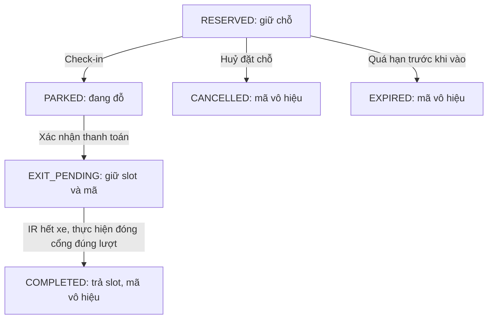

# Smart Parking: LED tại chỗ, website quản lý theo vé

LED trên ESP32 sáng khi IR slot thấy xe hoặc vé trên web đang đặt/sử dụng slot.
Website ở `parking.lordmc.net` quản lý
chỗ theo vé đặt chỗ, check-in và checkout; không dùng IR slot để tính chỗ.
Khi cập nhật bản này cần triển khai **cả backend và index.html**, rồi nạp firmware.

## 1. VPS (≈ 5 phút)

Cần Node.js ≥ 20.6 và MySQL 8.0+ (kiểm tra `node -v`). Công cụ chuyển dữ liệu
SQLite và bộ test cần Node.js 22.13+; nên dùng Node.js 24. Nếu cũ:
```bash
curl -fsSL https://deb.nodesource.com/setup_22.x | sudo -E bash -
sudo apt install -y nodejs build-essential
sudo npm i -g pm2
```
Tạo database và tài khoản riêng bằng tài khoản quản trị MySQL. Thay mật khẩu
ví dụ trước khi chạy:
```sql
CREATE DATABASE smart_parking CHARACTER SET utf8mb4 COLLATE utf8mb4_unicode_ci;
CREATE USER 'parking'@'127.0.0.1' IDENTIFIED BY 'THAY_MAT_KHAU';
GRANT SELECT, INSERT, UPDATE, DELETE, CREATE, ALTER, INDEX ON smart_parking.* TO 'parking'@'127.0.0.1';
```
Chép thư mục `server/` lên VPS (WinSCP → `/var/www/parking`), rồi:
```bash
cd /var/www/parking
npm install --omit=dev
cp .env.example .env && nano .env        # cấu hình MYSQL_*, DEVICE_TOKEN và ADMIN_TOKEN riêng
pm2 start server.js --name parking --node-args="--env-file=.env"
pm2 save && pm2 startup
curl http://127.0.0.1:3000/healthz       # → {"ok":true,"esp32":false}
```
Mở `server/nginx-snippet.conf`, dán 2 phần vào cấu hình Nginx của site, rồi `sudo nginx -t && sudo systemctl reload nginx`.

Tải lại trang: dòng trạng thái đổi từ "Mất kết nối máy chủ" sang "ESP32 offline…" (nghĩa là web đã nối được backend, chỉ còn chờ ESP32).

## 2. ESP32

Mở `esp32/parking_client/parking_client.ino`. Giữ WiFi thật trong `config.h`,
`SERVER_HOST "parking.lordmc.net"` và `DEVICE_TOKEN` trùng `.env` đang chạy trên VPS.
Firmware hiện tại chỉ dùng website/VPS, in `PARKING_CLIENT_V9_WEB_ONLY`
tại Serial 115200. Blynk đã tạm bỏ khỏi sketch; không cần cài thư viện Blynk
hoặc sửa `blynk_config.h`. LED và servo chạy trong main loop, không còn task
LED/Blynk hoặc spinlock chia sẻ do ứng dụng tạo. Pin servo vẫn Entry=33,
Exit=18. Chế độ thanh toán mô phỏng và đồng bộ reset MySQL/NVS vẫn giữ.
Nạp xong phải thấy `[WS] connected` và `[STATE] TX OK` khoảng mỗi 5 giây.

## 3. Kiểm thử nhanh
Đặt `HOLD_SECONDS=30` và `SECS_PER_HOUR=60` trong `.env`, bỏ dòng `HOLD_MIN`
cũ rồi `pm2 restart parking --update-env`. Đây cũng là giá trị mặc định mới.
60 giây là một chu kỳ tính phí mô phỏng (một "giờ"), không tự kết thúc vé hoặc
trả chỗ khi xe vẫn trong bãi. Nếu cần tính theo giờ thật, đặt `SECS_PER_HOUR=3600`.
Đặt chỗ → che IR cổng vào → Vào bãi → che IR cổng ra → Xem phí → Thanh toán, mở cổng.

### Thanh toán mô phỏng: bấm là mở cổng ra

Bản hiện tại mặc định `PAYMENT_SIMULATION=1` trong backend. Chép đồng thời
`server.js`, `public/index.html` và nạp firmware mới. Website đọc cấu hình từ
`/api/config`; ESP32 quảng bá `simulatedCheckout: true`. Khi vé đã PARKED,
bấm Xem phí rồi Thanh toán sẽ gửi lệnh có `simulate: true`, mở cổng ra dù IR
không thấy xe. Servo giữ mở ít nhất 2 giây, rồi đóng khi IR không có xe và
gửi `exit_complete` để trả slot, xoá vé trên web. Nếu IR còn xe, cổng giữ mở.
Timeout vẫn giữ vé để thử lại cùng phí và operationId. Cổng vào vẫn cần IR.
Đặt `PAYMENT_SIMULATION=0` để yêu cầu xe ở IR cổng ra theo luồng bên dưới.

## Quy tắc backend
- Chỗ hiển thị: `busy` (vé PARKED, “Đang sử dụng”) > `reserved` (vé RESERVED chưa hết hạn) > `free`.
- Giữ mã 30 giây (`HOLD_SECONDS=30`), quá hạn tự hết hiệu lực và trả chỗ nếu vé còn `RESERVED`. Check-in thành công đổi chỗ sang `busy`, giữ mã đến khi xe ra. Biến `HOLD_MIN` cũ không còn được dùng; thay bằng `HOLD_SECONDS` trong `.env`.
- Xác nhận thanh toán chuyển vé sang `EXIT_PENDING`: slot vẫn `busy`, mã và biển số vẫn được giữ. Chỉ sự kiện `exit_complete` đúng lượt mới kết thúc vé và trả chỗ về `free`.
- Huỷ đặt chỗ (`/api/cancel`) chỉ áp dụng `RESERVED`, không huỷ vé đã vào bãi hoặc đang chờ ra. `COMPLETED` vô hiệu hoá mã cũ nhưng giữ lịch sử; biển số có thể đặt vé mới.
- Mỗi biển số chỉ có 1 vé đang dùng (so sánh không phân biệt dấu chấm, gạch nối và khoảng trắng); mỗi IP tối đa 2 vé đang giữ chỗ.
- Sai mã 5 lần: IP bị khoá 1 phút. Thanh toán bắt buộc phải xem hoá đơn trước (trong 5 phút).
- Mất kết nối ESP32 quá 15 giây: web khoá các nút; cổng giữ đóng.
- "Thanh toán" hiện chỉ là bước xác nhận, chưa nối cổng thanh toán thật.

## Blynk Admin và reset bãi

**Blynk đang tạm ngừng trong firmware V9.** Các hướng dẫn Virtual Pin bên
dưới chỉ áp dụng bản trước. Hiện dùng website để vào/ra và API quản trị VPS
để reset toàn bãi hoặc từng slot; không dùng V10/V11/V12 trên Blynk.
Code trước khi bỏ Blynk được lưu tại `.build/backups/parking_client_blynk_v8.ino`.

Đã thêm 4 nút đóng/mở hai servo và 3 ô trạng thái vé giống website trên Blynk.
Điền cấu hình trong `esp32/parking_client/blynk_config.h`; token để trống thì
Blynk không chạy. Cần thư viện Blynk. Bảng Virtual Pin và hướng dẫn dashboard:
[BLYNK_ADMIN.md](esp32/parking_client/BLYNK_ADMIN.md).

Chọn V12 = 0 để reset toàn bãi hoặc 1–3 để reset riêng slot, rồi dùng V10
(chuẩn bị) và V11 (xác nhận trong 10 giây), sau khi phạm vi reset thật trống,
hai cổng đã đóng và IR cổng không thấy xe. Reset huỷ vé đang
dùng, giữ lịch sử và đồng bộ dấu reset vào NVS/MySQL; website chờ ESP32 xác
nhận rồi mới nhận vé mới. Restart ESP32 hoặc PM2 không tự xoá vé.

Quản trị có thể reset toàn bãi hoặc từng slot bằng `POST /api/admin/reset`.
Gửi header `Authorization: Bearer <ADMIN_TOKEN>`; không đưa token này vào
website công khai. Body ví dụ:
```json
{"requestId":"abcdef0123456789abcdef0123456789","slot":2}
```
Bỏ `slot` hoặc đặt `null` để reset toàn bãi. `requestId` là 32 ký tự hex mới
cho mỗi thao tác, có thể tạo bằng `openssl rand -hex 16`. Dùng lại đúng ID và
slot khi thử lại do mất phản hồi, tránh huỷ nhầm vé vừa đăng ký mới.
Phản hồi HTTP 202 với `status: "PENDING"` nghĩa là MySQL đã ghi reset, đang
chờ ESP32 lưu dấu reset và ACK. HTTP 200 với `COMPLETED` là yêu cầu cũ đã hoàn
tất; HTTP 409 nghĩa là chưa thực hiện được. Hai cổng phải đóng, IR cổng không
có xe; firmware phải quảng bá `slotReset: true` để reset riêng slot.
Reset riêng giữ nguyên vé/hoá đơn và lượt ra của slot khác. Các thao tác mới
tạm dừng trong lúc đồng bộ reset. Không dùng DELETE trực tiếp trong SQL vì
ESP32 cũng cần nhận dấu reset để vô hiệu hoá lượt cũ.

## Vòng đời checkout và mã vé



MySQL tự tạo bảng theo `server/schema.sql` khi khởi động. Các khoá duy nhất
`active_slot`, `active_plate` chỉ áp dụng vé đang hoạt động. Khi vé kết thúc,
slot và biển số được dùng lại, còn lịch sử vẫn giữ riêng theo mã cũ.
Đặt chỗ và reset dùng transaction InnoDB cùng khoá `parking_lock`.
Phí và mã lượt ra được lưu trước khi gửi lệnh tới ESP32.
Vé `EXIT_PENDING` không bị hết hạn hoặc dọn dữ liệu; lịch sử checkout được giữ
30 ngày tính từ lúc kết thúc hoặc huỷ vé. Nhật ký reset được lưu trong `admin_resets`.

Lệnh `open` cổng ra và ACK mang `operationId` duy nhất. ACK chỉ xác nhận đã
thực hiện mở servo. Khi IR hết xe ổn định và hết thời gian đóng cổng, ESP32
thực hiện đóng servo rồi lưu sự kiện `exit_complete` trong NVS. Sự kiện được
gửi lại mỗi 5 giây và khi reconnect cho tới khi backend trả `exit_complete_ack`
sau khi cập nhật MySQL. Sự kiện trùng không thay đổi thời điểm ra; sự kiện
sai lượt hoặc gói `state` báo `idle` không kết thúc vé.

ACK từ chối rõ ràng ở lần mở đầu tiên trả vé về `PARKED`. Timeout, mất mạng
hoặc từ chối ở lần thử lại giữ `EXIT_PENDING`, vì lệnh trước có thể đã mở cổng.
Thử lại sử dụng cùng mã lượt và phí đã lưu, không tính thêm tiền. Backend chỉ
cho một vé chờ hoàn tất tại cổng ra để không gán sự kiện cho xe khác.

`/api/ticket` và `/api/checkout/confirm` trả các trường `code`, `slot`,
`status`, `active`, `operationId`, `paymentStatus`, `fee`, `paidAt`, `exitAt`
cùng thông tin chu kỳ tính phí. `paymentStatus: "CONFIRMED"` là xác nhận nội
bộ của mô hình, chưa phải kết quả từ ngân hàng. Confirm trả HTTP 200 khi
cổng ACK hoặc vé đã COMPLETED, HTTP 202 khi chưa rõ phản hồi cổng và vẫn
EXIT_PENDING. Thử lại mã COMPLETED trả biên nhận với `active: false`,
`replayed: true`, không gửi lệnh mở cổng lần nữa. Vé CANCELLED do reset không
được khôi phục bởi sự kiện cũ; khoản phí đã ghi vẫn giữ để đối soát.

ESP32 quảng bá `exitComplete: true` trong gói trạng thái khi NVS hoạt động.
Backend từ chối checkout với firmware cũ. Khi ESP32 reboot, lượt `active`
được giữ lại; việc đóng servo lúc startup không phát sự kiện hoàn tất.
Chỉ thử lại đúng lượt với xe trước IR mới tiếp tục mở cổng. Lượt `done` chưa
được xác nhận tự gửi lại sau reboot/reconnect. Nếu reboot khi xe đã rời nhưng
chưa lưu `done`, hoặc NVS lỗi, cần nhân viên xác minh và đối soát; không tự
huỷ vé, xoá NVS hoặc giải phóng slot để bỏ qua trạng thái chưa rõ.

Website giữ vé trong localStorage đến khi server báo trạng thái kết thúc và
đồng bộ khi nhận trạng thái realtime, mỗi 5 giây, và trước khi đăng ký lại.
Vé `COMPLETED`/`CANCELLED`/`EXPIRED` hoặc không còn trong database được xoá
khỏi cache, ô mã và hoá đơn cũ. Vé mới luôn điền mã mới vào cả hai ô cổng,
không kế thừa mã lượt ra hay phí của vé trước. Có thể nhập mã đã biết ở tab Trả bãi để khôi
phục vé trên trình duyệt khác. Không có cơ chế tìm mã bằng biển số. Chế độ
`?demo` giữ vé ở `EXIT_PENDING` sau thanh toán vì không có IR thật.

## Cập nhật VPS đang chạy

1. Dừng backend cũ, sao lưu `parking.db` cùng `parking.db-wal`/`parking.db-shm`
   nếu có. Giữ nguyên token thiết bị trong `.env`; thêm biến `MYSQL_*` và
   `ADMIN_TOKEN` theo `.env.example`. Chép toàn bộ thư mục `server/` mới và
   chạy `npm install --omit=dev`. Tạo database MySQL rỗng như mục 1.
   Để giữ dữ liệu SQLite hiện có, chạy bằng Node.js 22.13+:
   ```bash
   node --env-file=.env scripts/migrate-sqlite.js /var/www/parking/parking.db
   ```
   Công cụ chỉ đọc SQLite, yêu cầu bảng MySQL đích rỗng, giữ vé và thanh toán
   còn hiệu lực, đổi giữ chỗ đã hết hạn sang EXPIRED. Lỗi sẽ rollback toàn bộ
   dữ liệu nhập. Không tự xoá database cũ. Nếu bãi mới và không cần nhập lịch
   sử, bỏ bước chuyển dữ liệu; backend tạo các bảng khi khởi động.
2. Cập nhật `server/public/index.html` vào đúng nơi Nginx đang phục vụ trang web.
   Nếu Express đang phục vụ trang thì dùng `/var/www/parking/public/index.html`;
   nếu Nginx phục vụ file tĩnh riêng, xem chỉ thị `root` trong cấu hình site.
3. Kiểm tra `node --check /var/www/parking/server.js`. Dùng `pm2 list` và
   `pm2 describe 1` để xác nhận đúng tiến trình trỏ tới `/var/www/parking/server.js`.
   Nếu đúng là ID 1 như lần kiểm tra trước, chạy `pm2 restart 1 --update-env`.
   Nếu ID đã đổi, dùng ID thực tế; không tạo thêm tiến trình cùng cổng 3000.
4. Kiểm tra `curl http://127.0.0.1:3000/healthz`, tải lại website bằng Ctrl+F5,
   rồi nạp firmware mới. Backend mới hỗ trợ cả gói cũ có `slots` và gói mới chỉ
   có entry/exit. Firmware mới cần backend mới để nhận trạng thái cổng đúng.

Tạm dừng checkout trong lúc cập nhật cả ba thành phần. Backend mới không
cho checkout với firmware cũ; không chạy lại backend cũ sau khi đã có vé
`EXIT_PENDING`, vì backend cũ không nhận biết trạng thái này.

## LCD và GPIO

Không đổi chân: IR slot 13/16/14; LED 25/26/27; IR entry 32, servo entry 33;
IR exit 34, servo exit 18; LCD SDA 21, SCL 22.

LCD quét I2C 100 kHz lúc khởi động. Serial in địa chỉ phản hồi, ưu tiên 0x27,
rồi 0x3F. Màn hình cần hiện `Smart Parking` / `LCD OK` trước khi kết nối WiFi.
ACK I2C chỉ chứng minh có thiết bị phản hồi, không tự chứng minh đó là LCD
hoặc chữ đã hiển thị đúng. Không tìm thấy hai địa chỉ thì firmware bỏ qua LCD,
vẫn chạy LED và cổng. Chỉ ghi LCD khi nội dung đổi, mỗi dòng tối đa 16 ký tự.

Nếu LCD sáng nhưng còn ô vuông dù báo khởi tạo: chỉnh biến trở tương phản từ
từ, kiểm tra dây SDA/SCL, GND chung và loại backpack tương thích thư viện.
Phần mềm không xác nhận được chất lượng nguồn hoặc chuyển động servo thực tế.

## Kiểm thử bản này

- Chạy `node --test server/test/*.test.js` bằng Node 22.13+ (đã chạy bằng
  Node 24). Test dùng adapter SQLite trong RAM, mô phỏng thiết bị và đồng hồ,
  và mock driver để kiểm tra transaction MySQL; không cần
  token thật, không mở cổng hoặc sửa dữ liệu VPS. Backend sản xuất vẫn dùng
  Node >=20.6 với các dependency trong package.json.
- Các test này không thay thế kiểm thử MySQL thật hoặc biên dịch/nạp firmware
  trên board. Sau chuyển dữ liệu, kiểm tra lại đặt chỗ, thanh toán thử lại,
  reset từng slot và đăng ký cùng biển số sau trả bãi.
- Trên board thật: che IR từng slot ít nhất 500 ms, bỏ vật cản ít nhất 500 ms;
  chỉ LED tương ứng đổi, website không đổi. Kiểm tra lại khi mất WiFi.
- Slot trên website đi qua Đã đặt → Đang sử dụng → Trống. Sau thanh toán,
  giữ xe trước IR cổng ra: slot vẫn Đang sử dụng và mã vẫn còn. Cho xe rời IR,
  cổng đóng: slot mới Trống và mã cũ không còn dùng được. Vé đang sử dụng hoặc
  chờ xe ra không thể đặt trùng slot/biển số.
- Thử mất mạng sau mở cổng: slot vẫn Đang sử dụng, reconnect gửi lại sự kiện
  hoàn tất. Thử reboot trước khi xe ra: slot vẫn giữ, cần thử lại cùng lượt;
  không được tự trả chỗ chỉ vì servo đóng lúc startup.
- IR cổng lọc 100 ms; mã hợp lệ chỉ mở khi xe còn trước IR. Không có xe, sai mã,
  mã hết hạn hoặc ACK bị từ chối thì vé không chuyển trạng thái.
- ACK thành công được gửi sau lệnh `servo.write()` và trước cập nhật LCD.
  Đây là xác nhận lệnh phần mềm, không phải cảm biến đo vị trí servo.
- Xe rời IR thì entry đóng sau 2 giây, exit sau 500 ms, tính từ khi tín hiệu
  đã lọc báo xe rời. Quan sát cả hai servo với điều kiện vật lý an toàn.
- Chạy board ít nhất 5 phút: không có timeout, LCD ổn định, heartbeat giữ
  trạng thái online. Test đồng hồ giả lập 5 phút không thay thế bước này.
